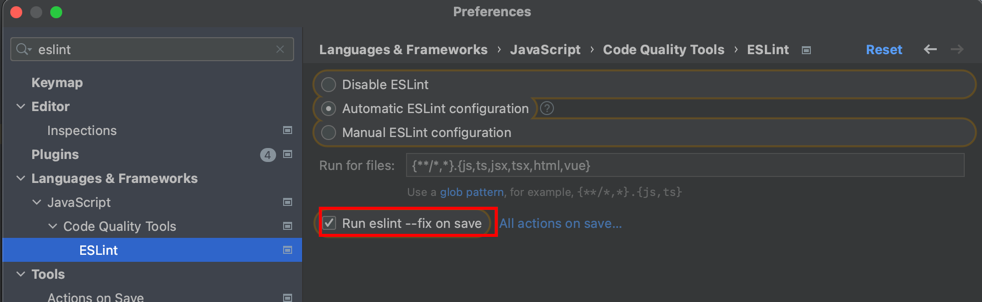
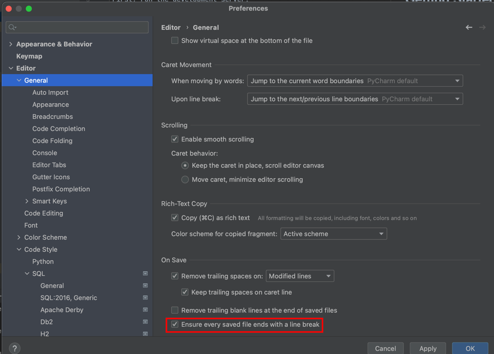

## Getting Started

1. Install env variables: `cp .env.local.sample .env.local`
2. Run:
```bash
cd frontend/
npm install  # we use node v16 & npm v8
npm run dev
```

### Our Rules for writing Frontend:
1. All new pages should be written in [app directory](https://beta.nextjs.org/docs/getting-started).
2. Authentication mechanism is written using `pages` directory only to work with `NextAuth`.
3. Use `GET` methods for fetching data in server-side components (SSR) - and transfer them to client components with Antd.
4. For `POST`, `PATCH` and so on use client components.
5. CSS:
   1. We use [Antd](https://ant.design/) library for beautiful components
   2. We use [Tailwind](https://tailwindcss.com/) instead of writing css for customization.
   3. We do not write custom `.css` files and do not create own css classes.
6. PyCharm - we use it both for Python & JS:
   1. Configure running `eslint --fix` on each save: 
   **Please, note:** if you have problems with eslint installation - try to update your PyCharm.
   2. Configure adding empty line to the end of each file: 
   3. Configure adding quotes for `className` but not brackets by default: 


### Minimal NextJS project example:
Here is Todo App created using NextJS + DRF for easier understanding of the process:

Frontend: https://github.com/danylott/next-todo-front

Backend: https://github.com/danylott/todo-back-drf

### Note
Frontend could throw some errors because of Google Chrome browser extensions (it was LastPass for me).
