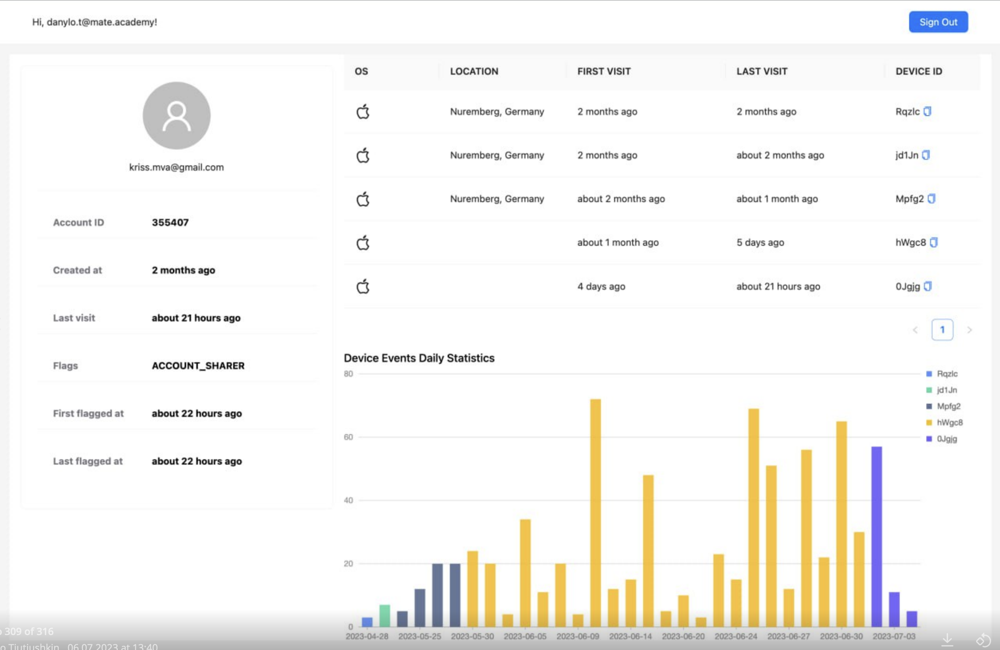

## Getting Started

1. Install env variables: `cp .env.local.sample .env.local`
2. Run:
```bash
cd frontend/
npm install  # we use node v16 & npm v8
npm run dev
```

### Demo

- 
- 


### Minimal NextJS project example:
Here is Todo App created using NextJS + DRF for easier understanding of the process:

Frontend: https://github.com/danylott/next-todo-front

Backend: https://github.com/danylott/todo-back-drf

### Note
Frontend could throw some errors because of Google Chrome browser extensions (it was LastPass for me).
